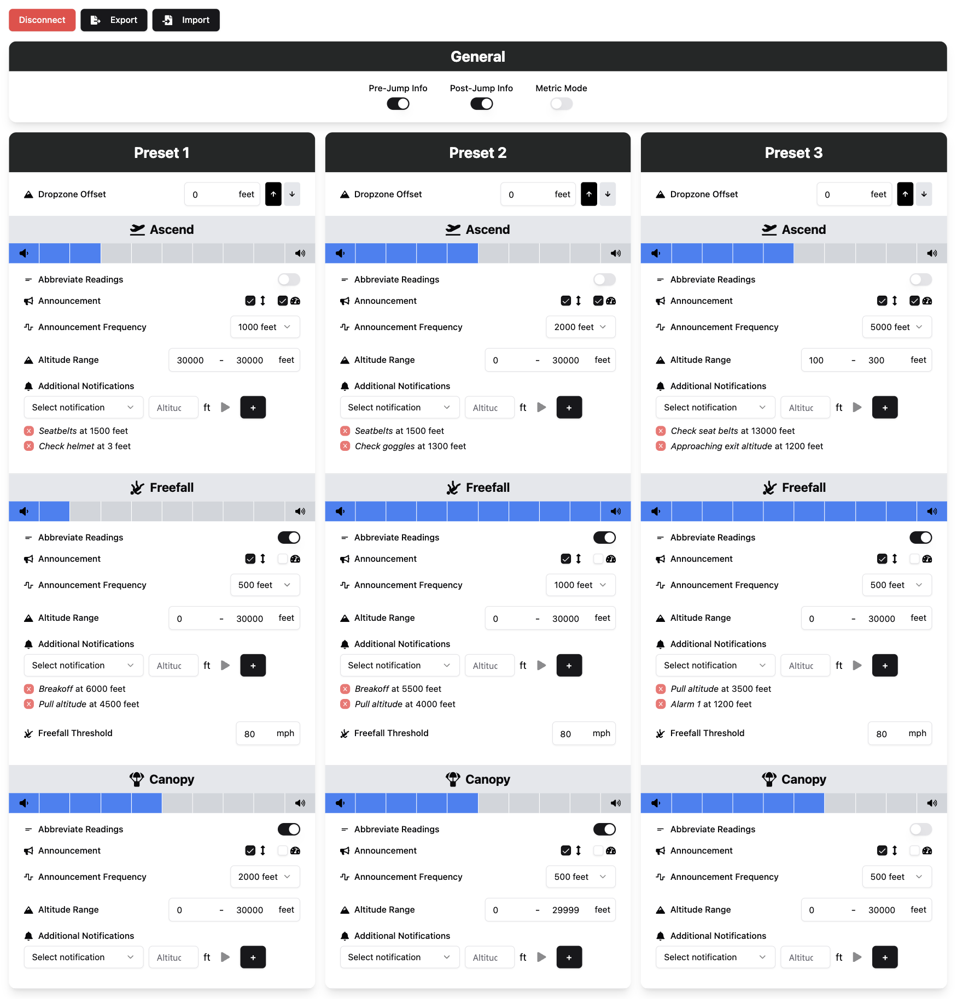

> [!NOTE]  
> This project is not supported by or affiliated with Freefall Data Systems, the manufacturer of the SonoAlti 3V/4V.

# Sonoalti 3V/4V WebUSB App

This is a web-based application for configuring a SonoAlti 3V/4V skydiving altimeter using WebUSB. The application allows you to easily import and export your altimeter settings, making it a convenient tool for managing your altimeter configuration.

This is an improved version of the [SonoAlti 3V/4V WebUSB App](https://freefalldatasystems.com/sonoalti_3v_web_app) by [Freefall Data Systems](https://freefalldatasystems.com/).

## Live version

Check out a live version of the app over at [sonoalti.lenn.app](https://sonoalti.lenn.app).

## Features

- Seamlessly change your altimeter settings with an easy-to-use interface
- Import and export your altimeter settings, saving you the hassle of having to manually reconfigure your altimeter after a firmware update



## Building the application

You can build the application yourself using either standard Node.JS commands or Docker. Below are the instructions for both methods, which will output the built application to `./dist`:

### Using Node.JS

1. Ensure Node.JS is installed on your system
2. Open a terminal and navigate to the project’s root directory.
3. Install the required dependencies:
   ```bash
   npm install
   ```
4. Build the application:
   ```bash
   npx vite build
   ```

### Using Docker

Alternatively, you can use Docker to build the application:

1. Open a terminal and navigate to the project’s root directory.
2. Execute the following Docker command to build the application:

```bash
DOCKER_BUILDKIT=1 docker build -f Dockerfile.build --target export --output type=local,dest=./dist . && \
find ./dist -mindepth 1 -maxdepth 1 ! -name 'app' -exec rm -rf {} + && \
mv ./dist/app/* ./dist/ && rmdir ./dist/app
```

## Support and Contributions

For help or feature requests, please visit the issues page!
